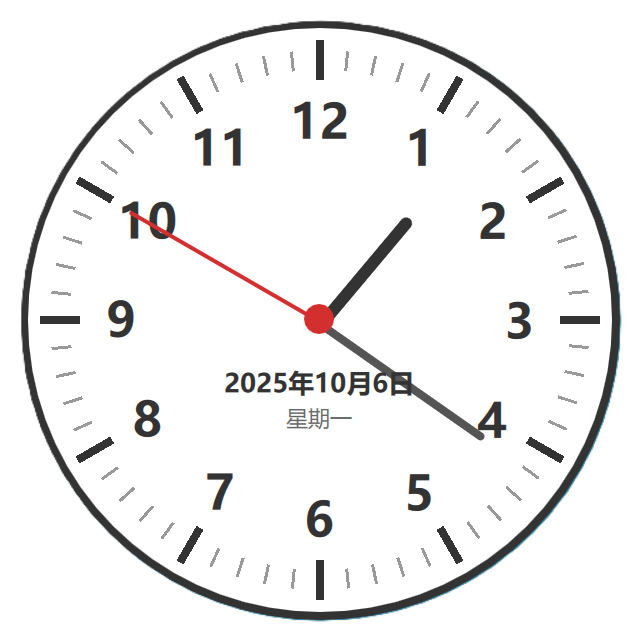

# 模拟时钟应用 🕐

一个简洁美观的桌面模拟时钟应用,使用 PySide6 (Qt for Python) 和 QML 开发。



## 功能特性

- ✨ **精美的模拟时钟界面** - 传统的圆形时钟设计,带有时针、分针和秒针
- 📅 **日期显示** - 显示当前日期和星期
- 🎨 **透明背景** - 无边框窗口,可融入桌面
- 📌 **窗口置顶** - 支持窗口置顶功能,方便随时查看时间
- 🖱️ **可拖动** - 左键拖动窗口到任意位置
- ⚡ **快速退出** - 双击窗口或右键菜单退出

## 界面预览

时钟采用经典设计:
- 60个刻度线(时刻度和分刻度)
- 1-12的时钟数字
- 三根指针:时针(粗黑)、分针(灰色)、秒针(红色)
- 中心红色圆点
- 显示当前日期和星期

## 系统要求

- Python 3.7 或更高版本
- Windows / macOS / Linux

## 安装依赖

```bash
pip install -r requirements.txt
```

或直接安装:

```bash
pip install PySide6
```

## 运行应用

### 方式一:使用 Python 运行

```bash
python main.py
```

### 方式二:使用可执行文件(如果已打包)

```bash
clock.exe
```

## 使用说明

1. **移动窗口** - 左键按住时钟拖动
2. **置顶/取消置顶** - 右键点击时钟,选择"置顶"菜单项
3. **退出程序**:
   - 双击时钟
   - 或右键点击,选择"退出"

## 项目结构

```
clock_app/
├── main.py            # Python 主程序入口
├── main.qml           # QML 界面定义
├── requirements.txt   # Python 依赖
├── pyproject.toml     # 项目配置
├── clock.exe          # 可执行文件(已打包)
├── runtime/           # Python 运行时
└── site-packages/     # Python 依赖包
```

## 技术栈

- **Python 3** - 编程语言
- **PySide6** - Qt for Python 框架
- **QML** - 声明式界面语言

## 开发说明

项目使用 PySide6 的 QML 引擎来渲染界面,主要代码分为两部分:

- `main.py` - 创建应用实例和加载 QML 界面
- `main.qml` - 定义时钟的视觉外观和交互逻辑

时钟使用 `Timer` 每秒更新一次,计算指针旋转角度:
- 秒针:每秒 6°
- 分针:每分钟 6° + 秒数影响
- 时针:每小时 30° + 分钟影响

## 许可证

本项目仅供学习和个人使用。

---

💡 **提示**: 如需将应用打包为独立可执行文件,可使用 PyInstaller 或 Nuitka 等工具。
