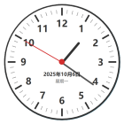

# 模拟时钟应用 🕐

基于 PySide6 和 QML 开发的桌面模拟时钟应用。



## 功能特性

- ✨ 精美的圆形时钟界面,带有时针、分针和秒针
- 📅 显示当前日期和星期
- 🎨 透明背景,无边框窗口
- 📌 支持窗口置顶
- 🖱️ 可拖动到任意位置
- 🔔 系统托盘支持,最小化到托盘
- ⚡ 双击或右键菜单退出

## 快速开始

### 安装依赖

```bash
pip install PySide6
```

### 运行应用

```bash
python main.py
```

或直接运行打包好的可执行文件:

```bash
clock.exe
```

## 使用说明

- **移动窗口** - 左键拖动
- **置顶/取消置顶** - 右键菜单选择"置顶"
- **系统托盘** - 单击托盘图标显示/隐藏窗口,右键查看菜单
- **退出程序** - 双击时钟或右键选择"退出"

## 项目结构

```
clock_app/
├── main.py            # Python 主程序
├── main.qml           # QML 界面
├── app.py             # 应用入口
├── requirements.txt   # 依赖列表
├── resources.qrc      # 资源文件
├── clock.exe          # 可执行文件
├── runtime/           # Python 运行时
└── site-packages/     # 依赖包
```

## 技术栈

- Python 3.12+
- PySide6 (Qt for Python)
- QML

---

💡 仅供学习和个人使用
